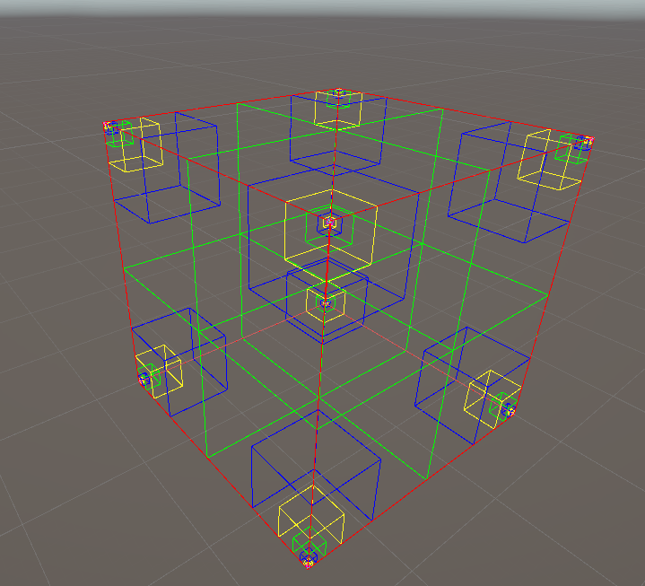

# Octree - обзор возможностей
Octree (восьмеричное дерево) - это древовидная структура данных, используемая для пространственного разделения 3D-пространства. Она особенно полезна в таких задачах, как:
  * Управление воксельными мирами
  * Определение видимости (occlusion culling)
  * Физические коллизии
  * Поиск ближайших объектов

Моя реализация Octree на C# для Unity позволяет:

**Основная структура Octree**
```csharp
public class Octree<Type>
{
    private Node<Type> root;
    private GameObject parentObject;
    private int octreeSize;
    private int leafSize;
    // ... другие поля
    
    public Octree(Vector3Int basePoint, GameObject parent, int oSize, int lSize)
    {
        octreeBasePoint = basePoint;
        parentObject = parent;
        octreeSize = oSize;
        leafSize = lSize;
        // ... инициализация
    }
    
    private class Node<Type>
    {
        public Node<Type>[] subNodes;
        public Node<Type> parent;
        public int nSize;
        public Vector3Int nBasePoint;
        // ... другие поля
    }
}
```
**Вставка элементов**

Основной метод вставки использует рекурсивный подход.
```csharp
private void BuildChunkOrVoxelByIndex(Node<Type> node, int[] index, VoxelData data, int depth)
{
    if (depth == 3 && this.GetType() == typeof(Octree<Chunk>))
    {
        // Создание чанка
        node.isLeaf = true;
        string chunkName = data.chunkIndex[0] + "" + data.chunkIndex[1] + "" + data.chunkIndex[2];
        InstanceDescr chunkDesr = new InstanceDescr(int.Parse(chunkName), chunkName);
        GameObject chunkGO = new GameObject(chunkName);
        Chunk chunk = chunkGO.AddComponent<Chunk>();
        chunk.Initialize(chunkDesr, node.nBasePoint, parentObject);
        chunk.AddVoxel(data);
        return;
    }
    else if (depth == index.Length && this.GetType() == typeof(Octree<Voxel>))
    {
        // Создание вокселя
        node.leafObject = GameObject.CreatePrimitive(PrimitiveType.Cube);
        node.voxelData = data;
        node.leafObject.AddComponent<VoxelDataEntity>().ApplyData(data);
        node.leafObject.transform.parent = parentObject.transform;
        node.leafObject.transform.position = node.nBasePoint;
        // ... настройка имени и сохранение
        return;
    }

    // Разделение узла на подузлы при необходимости
    if (node.subNodes == null)
    {
        int subNodeSize = node.nSize / 2;
        node.subNodes = new Node<Type>[8];
        Vector3Int[] subNodesOffsets = new Vector3Int[]
        {
            // ... 8 направлений для подузлов
        };
        
        for (int i = 0; i < 8; i++)
        {
            Vector3Int subNodeBasePoint = node.nBasePoint + subNodesOffsets[i];
            Vector3 subNodeCenter = subNodeBasePoint + new Vector3(subNodeSize, subNodeSize, subNodeSize) * 0.5f;
            node.subNodes[i] = new Node<Type>(subNodeSize, subNodeBasePoint, subNodeCenter) { parent = node };
        }
    }
    
    // Рекурсивный вызов для соответствующего подузла
    BuildChunkOrVoxelByIndex(node.subNodes[index[depth]], index, data, depth + 1);
}
```
**Определение позиции в Octree**
```csharp
private PositionParameters GetPositionParameters(Vector3Int voxelPositionInt, int nodeSize, Vector3 offset)
{
    PositionParameters posParams;
    int index = 0;
    
    // Определение позиции по X, Y и Z
    if (voxelPositionInt.x > nodeSize / 2) index |= 1;
    if (voxelPositionInt.y > nodeSize / 2) index |= 4;
    if (voxelPositionInt.z > nodeSize / 2) index |= 2;
    
    posParams.index = index;
    posParams.offset = offset;
    return posParams;
}
```
**Удаление элементов**
Octree также поддерживает удаление элементов с очисткой пустых узлов.
```csharp
private void RemoveEmptyNodes(Node<Type> node)
{
    if (node == null) return;
    
    bool hasSubNodes = node.subNodes != null && node.subNodes.Any(n => n != null);
    bool hasVoxels = node.leafObject != null;
    
    if (!hasSubNodes && !hasVoxels && node.parent != null)
    {
        // Проверка всех подузлов родителя
        bool anySubnodeHasData = node.parent.subNodes.Any(n => 
            n != null && (n.subNodes != null || n.leafObject != null));
        
        if (!anySubnodeHasData)
        {
            node.parent.subNodes = null;
        }
        
        RemoveEmptyNodes(node.parent);
    }
}
```
**Визуализация Octree**
```csharp
public void DrawBounds(Vector3Int basePoint, int size, int depth)
{
    Color color = Color.red;
    switch (depth)
    {
        case 5: color = Color.cyan; break;
        case 4: color = Color.magenta; break;
        // ... другие уровни глубины
    }
    
    // Отрисовка линий куба
    Vector3 p1 = new Vector3Int(0, 0, 0) + basePoint;
    Vector3 p2 = new Vector3Int(0, 0, size) + basePoint;
    // ... другие вершины
    
    Debug.DrawLine(p1, p2, color, 30f);
    // ... другие линии
}
```
**Применение Octree**
```csharp
Чанки
Octree<Chunk> chunkTree = new Octree<Chunk>(basePoint, parentObj, 256, 32);
chunkTree.AddChunk(voxelsDataList);

Воксели
Octree<Voxel> voxelTree = new Octree<Voxel>(basePoint, parentObj, 32, 1);
voxelTree.AddVoxel(voxelData);
```
Octree предоставляет эффективный способ организации 3D-пространства, особенно для воксельных миров. Реализация в Unity позволяет:

  * Быстро находить элементы по их позиции
  * Оптимизировать рендеринг и физические расчеты
  * Динамически управлять памятью, удаляя пустые узлы


